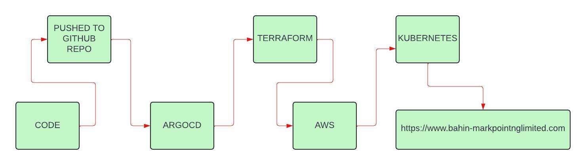
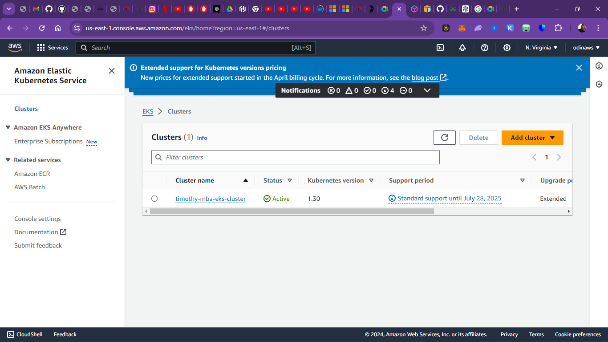
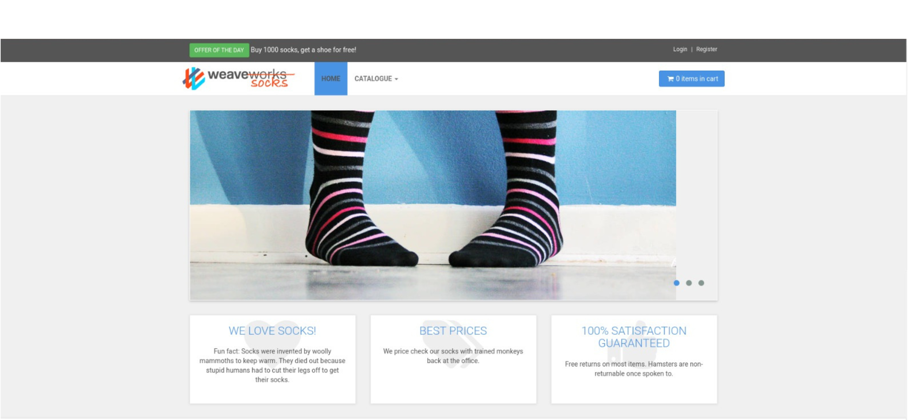
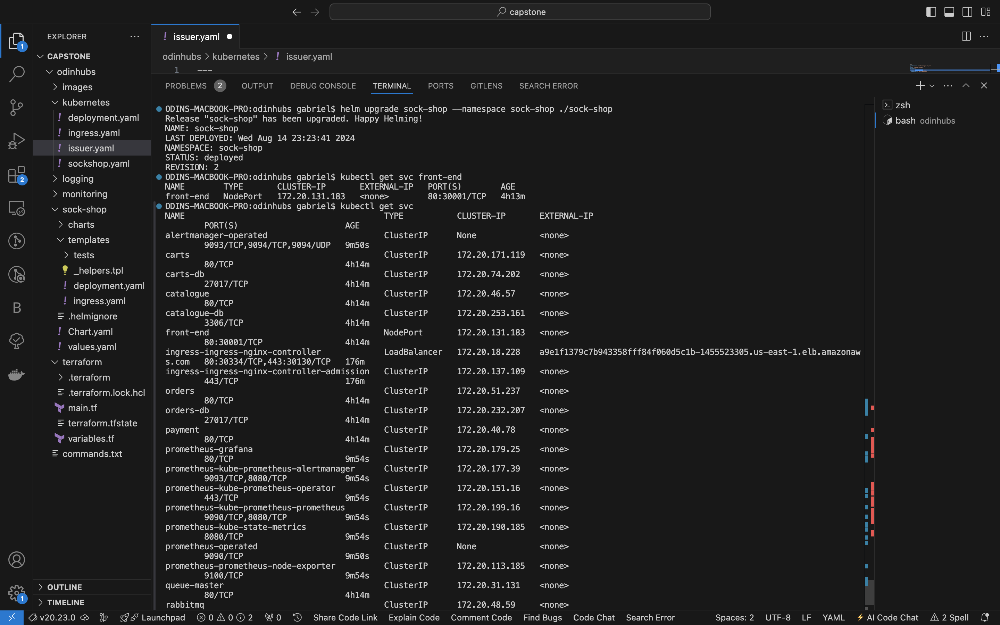
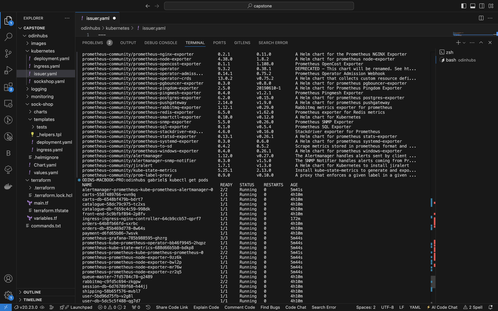

# **Socks Shop Microservices-based Application Deployment.**




**PROJECT LIVE LINK:** [CAPSTONE PROJECT LINK](https://www.bahin-markpointnglimited.com)

### Domain name: https://www.bahin-markpointnglimited.com

## Setup Details:
* Provision the Socks Shop example microservice application -
https://microservices-demo.github.io/

### Prerequisites:

* AWS account

* AWS CLI

* Kubectl

* Terraform

* Helm

* ArgoCD

* Docker

* Github repo

# Step 1:
After installing the prerequisites, we need to configure the AWS CLI.
* Configure the AWS CLI

```bash 
 aws configure
 ```

$ AWS Access Key ID [None]: <YOUR_AWS_ACCESS_KEY_ID>

$ AWS Secret Access Key [None]: <YOUR_AWS_SECRET_ACCESS_KEY>

$ Default region name [None]: <YOUR_AWS_REGION>


### Setting Up S3 Bucket and DynamoDB for Terraform State Management

#### Introduction
This README provides step-by-step instructions for setting up an S3 bucket to store Terraform state files and a DynamoDB table for state locking using Terraform configuration.

#### Prerequisites
1. An AWS account with appropriate permissions to create S3 buckets and DynamoDB tables.
2. Terraform installed on your local machine.

#### Step 1: Configure Provider and Variables
Ensure that the `provider.tf` and `variable.tf` files are configured correctly. These files specify the AWS provider and define variables such as region, S3 bucket name, and DynamoDB table name.

#### Step 2: Create S3 Bucket for Terraform State
The `main.tf` file defines resources for creating an S3 bucket to store Terraform state files.
- The `aws_s3_bucket` resource creates the S3 bucket with the specified name.
- The `aws_s3_bucket_versioning` resource enables versioning for the S3 bucket.
- The `aws_s3_bucket_server_side_encryption_configuration` resource configures server-side encryption for the S3 bucket.

#### Step 3: Create DynamoDB Table for State Locking
The `main.tf` file also defines a resource for creating a DynamoDB table to manage state locking.
- The `aws_dynamodb_table` resource creates the DynamoDB table with the specified name and attributes.
- The `hash_key` attribute is set to "LockID", which is used for state locking.

#### Step 4: Customize Configuration
Customize the configuration by updating variables in the `variable.tf` file according to your preferences, such as region, S3 bucket name, and DynamoDB table name.

#### Step 5: Terraform Initialization and Deployment
1. Initialize Terraform by running `terraform init` in your project directory.
2. Review the execution plan by running `terraform plan`.
3. Apply the Terraform configuration by running `terraform apply`. Confirm the changes when prompted.

#### Step 6: Verify Resources
After Terraform applies the configuration, verify that the S3 bucket and DynamoDB table are created successfully in the AWS Management Console.

#### Step 7: Integration with Terraform Projects
Integrate the configured S3 bucket and DynamoDB table with your Terraform projects by specifying the backend configuration in the `backend.tf` file:
```hcl
terraform {
  backend "s3" {
    bucket         = "odin-bucket"
    key            = "terraform-aws-eks-workshop.tfstate"
    region         = "us-east-1"
  }
}
```


#### Note
This should not include in your pipeline deployment directory as it should be done seperately in a different directory.

#### Conclusion
You have successfully set up an S3 bucket for storing Terraform state files and a DynamoDB table for state locking. These resources can now be used to manage Terraform state effectively and securely.


# Step 2: 

## Terraform Initial Setup Configuration
Create an AWS provider. it will be used to interact the resources in AWS such as EKS, VPC, etc.
* Create a new directory for your project and change into it.
* Create a new file called provider.tf and add the following ref: terraform/provider.tf

## Terraform state file
Create terraform backend to specify the location of the state file on S3 bucket.
note: Remote state is a Terraform feature that allows you to store the state file in a remote location. This is useful when you are working with a team and want to share the state file.
* Create a new file called backend.tf and add the following ref: terraform/backend.tf

## Network Setup
Setup the VPC, Subnets, Internet Gateway, Route Table, Security Group, etc.
* Create a new file called vpc.tf and add the following ref: terraform/vpc.tf

## EKS Cluster Setup
1. Create an EKS cluster
2. Setup IAM roles and policies for the cluster
IAM roles and policies are used to control access to AWS resources. In this case, we will create a role that will allow the EKS cluster to access other AWS resources.
* Create a new file called eks-cluster.tf and add the following ref: terraform/eks-cluster.tf

## EKS Node Group Setup
Create a node group to run appplication workloads.
IAM Role: similar to the cluster role, we will create a role that will allow the nodes to access other AWS resources.
IAM Policy: Attach the AmazonEKSWorkerNodePolicy, AmazonEKS_CNI_Policy policies and AmazonEC2ContainerRegistryReadOnly policy to the role.
Create a new file called node.tf and add the following ref: terraform/node-group.tf

## Terraform variables
Define variables for the project.
* Create a new file called variables.tf and add the following ref: terraform/variable.tf

## Define data sources
Define data sources for the project.
* Create a new file called data.tf and add the following ref: terraform/data.tf

## Terraform 
Define tfvars for the project.
* Create a new file called tfvars.tf and add the following ref: terraform/tfvars.tf

## Terraform outputs
 Define outputs for the project.
* Create a new file called outputs.tf and add the following ref: terraform/output.tf




# Step 3:

## Lets continue to the Github Actions workflow and directory structure of the project. 

## GitHub Actions Workflow

### Pipeline Deployment Script

This repository includes a GitHub Actions workflow script (`config.yml`) for deploying infrastructure and applications to an AWS EKS cluster using Terraform and Kubernetes manifests.

### Workflow Overview
1. **Pipeline Deployment Script**: Defines a GitHub Actions workflow named "Terraform and Deploy to EKS".
2. **Trigger**: The workflow is triggered on pushes to the `main` branch.
3. **Environment Variables**: Sets environment variables for AWS credentials and region.
4. **Jobs**:
   - **terraform**: Executes Terraform commands to provision infrastructure.
   - **k8s_apply**: Deploys applications and configures Kubernetes resources.

### `terraform` Job:
- **Name**: Terraform
- **Runs on**: Ubuntu latest
- **Steps**:
  - Checkout
  - Configure AWS Credentials
  - Login to Amazon ECR
  - Install kubectl
  - Install ArgoCD CLI
  - Install Terraform CLI
  - Terraform Init
  - Terraform Plan
  - Terraform Destroy (conditionally)

### `k8s_apply` Job:
- **Name**: Deploy to Kubernetes
- **Runs on**: Ubuntu latest
- **Dependencies**: Depends on the `terraform` job.
- **Steps**:
  - Checkout
  - Configure Kubeconfig
  - Install Helm
  - Add Argo CD Helm repository
  - Deploy Prometheus Operator CRDs
  - Install Argo CD
  - Create monitoring namespace if it does not exist
  - Add NGINX Ingress Controller Helm repository
  - Install NGINX Ingress Controller
  - Install cert-manager
  - Install Certificate CRD
  - Apply Kubernetes Manifests
  - Deploy ELK Stack
  - Verify kubectl configurations

This workflow automates the deployment process, ensuring consistency and reliability when deploying infrastructure and applications to an AWS EKS cluster.

## Here is the directory structure for the deployment 

```
apps/
│
├── argocd/
│   ├── argocd.yaml
│   └── argocd-cluster-role.yaml
│
├── autoscaling/
│   └── (files)
│
├── elk/
│   └── (files)
│
├── helm-chart/
│   └── (files)
│
├── ingress/
│   └── (files)
│
├── manifests-alerting/
│   └── (files)
│
├── manifest-jaeger/
│   └── (files)
│
├── manifests-loadtest/
│   └── (files)
│
├── manifests-logging/
│   └── (files)
│
├── manifests-monitoring/
│   └── (files)
│
├── manifests-policy/
│   └── (files)
│
└── sock-shop/
    └── complete-demo.yaml

```
# Step 4:

This structure appears to organize various Kubernetes manifests and configuration files for different applications and components related to monitoring, logging, ingress, autoscaling, and more. Refer to this link "https://github.com/microservices-demo/microservices-demo/tree/master/deploy/kubernetes" to get the files in the directory listed above. Each subdirectory contains files specific to its purpose.

## Now lets push the setup to clone Github repo using this commands.

To push files to a GitHub repository after cloning it locally, follow these steps:

1. **Clone the Repository**: If you haven't already, clone the GitHub repository to your local machine using the `git clone` command. Replace `<repository-url>` with the URL of your GitHub repository.

    ```bash
    git clone capstone-git
    ```

2. **Navigate to the Repository Directory**: Move into the directory created by the clone operation.

    ```bash
    cd capstone-git
    ```

3. **Add Files to Staging Area**: Add the files you want to commit to the staging area using the `git add` command. You can specify individual files or directories. For example, to add all files, use:

    ```bash
    git add .
    ```

4. **Commit Changes**: Commit the changes to the local repository along with a meaningful commit message.

    ```bash
    git commit -m "apply" or change to "destroy" for deleting the pipeline.
    ```

5. **Push Changes to GitHub**: Push the committed changes from your local repository to the GitHub repository using the `git push` command. You may need to specify the branch name if it's not the default `main` branch.

    ```bash
    git push origin main
    ```

Replace `main` with the name of your branch if you're working on a different branch.

Note that apply commands will be uncommented to trigger the deployment while destroy will be commented out and vice versa for desired operation. 

By executing these commands, you'll push your changes to the GitHub repository, making them available for GitHub Actions to use when triggering the deployment pipeline. Make sure you have appropriate permissions to push changes to the repository and make sure your 'AWS ACCESS KEY ID' and 'AWS SECRET ACCESS KEY' is installed in your actions tab under Secrets and variables when you click settings of your working repository.

# Step 5:

*After the successful deployment of the files using Github Actions, we need to add the cluster to our local kubctl config or we update the context

```bash
aws eks --region <YOUR_AWS_REGION> update-kubeconfig --name <YOUR_EKS_CLUSTER_NAME>
```

* Create a namespace for the argocd application if needed

```bash
 kubectl create namespace argocd
```

* Confirm argocd installation

```bash
 kubectl get pods -n argocd
```

* Expose the argocd application

by default, the argocd application is not exposed to an external IP address. 
* We need to expose the argocd application to a load balancer.

```bash
 kubectl patch svc argocd-server -n argocd -p '{"spec": {"type": "LoadBalancer"}}' -n argocd
 ```

* Get the argocd application password

```bash
 kubectl get secret argocd-initial-admin-secret -n argocd -o jsonpath="{.data.password}" | base64 -d; echo -n argocd
```

to login to the argocd application

* Get the argocd application load balancer

```bash
 kubectl get svc -n argocd
```


use the load balancer to login to the argocd application

## Connecting ArgoCD to git repo

* Open the repository management menu and click on "Repositories" tab.

* Connect repo using https

* Add the repo url and click on "Connect"

## Setup argocd app of apps

### App Creation Page

* Click on "New App" button

* Fill the form with the following details:

* Application Name: root

* Project: default

* Sync Policy: Automatic

* Sync Options: auto create namespace

* Cluster: https://kubernetes.default.svc

* repo url: select the repo url

* Path: select the path

* Revision: HEAD

* Click on "Create" button

### App Details Page

* Click on "Sync" button

## Deploy other applications using helm charts

Traditionally, in Argo CD, we can deploy applications with configurations in manifests that are the same as those we run ‘kubectl apply’ on. However, in our case, we use Helm charts (because it’s easier).

### The /apps directory is the place where we store all the applications that we want to deploy.

* Go to the argocd application and click on sync button



### Find more images in the screenshot directory.


* ref: https://medium.com/devops-mojo/terraform-provision-amazon-eks-cluster-using-terraform-deploy-create-aws-eks-kubernetes-cluster-tf-4134ab22c594

* ref: https://faun.pub/continuous-deployments-of-kubernetes-applications-using-argo-cd-gitops-helm-charts-9df917caa2e4
# capstone-sockshop
